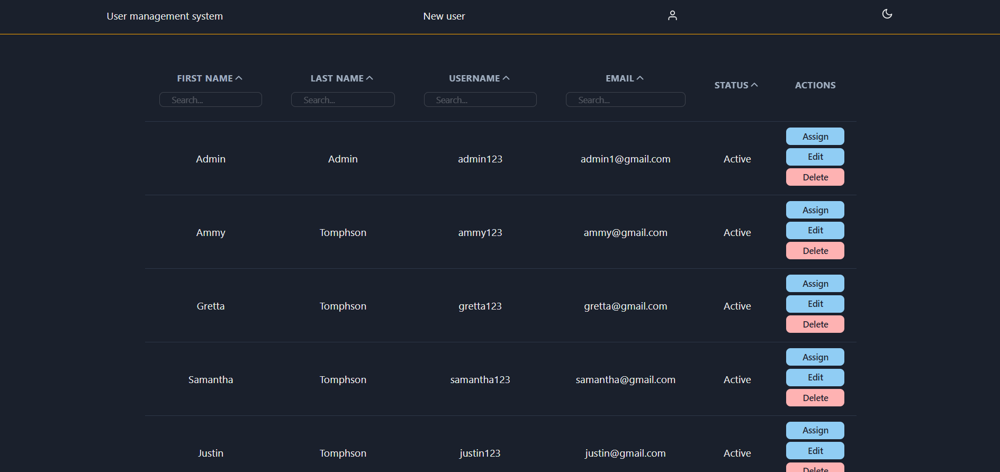

# [User management system](https://user-management-system-client.vercel.app/)

[](https://github.com/merima98/user-management-system-client/blob/main/LICENSE)



### `Getting started`

```
    git clone https://github.com/merima98/user-management-system-client.git
    cd user-management-system-client
    yarn install
    yarn start
```

### `Testing`

Project contains e2e(`cypress`) tests.

```
"cypress:open": "cypress open",
```

### `License`

[MIT](./LICENSE)
